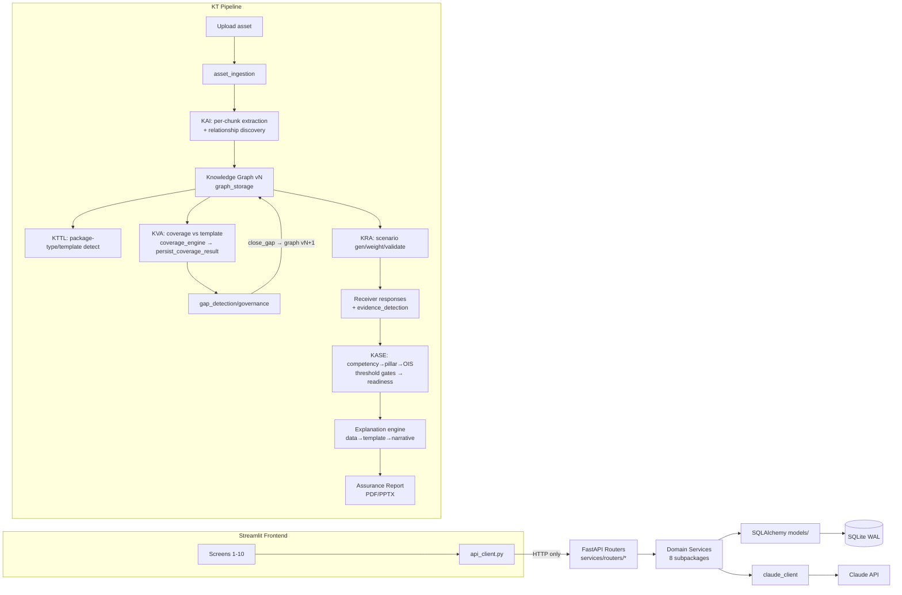

# KT-Assist — Architecture

## 1. Core Tech Stack
- **Backend:** FastAPI 0.115 (app-factory in `app.py`) + Uvicorn; Pydantic v2 schemas
- **ORM/DB:** SQLAlchemy 2.0.35 → SQLite (WAL mode), engine/session in `database.py`; Alembic present
- **Frontend:** Streamlit 1.45.0 (`streamlit_app.py` + `frontend/`), talks to backend **via HTTP only** (`frontend/api_client.py`) — architected for future React swap at API level
- **LLM:** Anthropic SDK 0.34.2 (`services/core/claude_client.py`) — extraction, generation, evidence detection, narrative **only**
- **Graph:** networkx 3.3 (engine) + pyvis (viewer)
- **Parsing:** python-docx, python-pptx, pypdf, pdfplumber
- **Export:** reportlab (PDF), python-pptx (PPTX)
- **Tests:** pytest, ~515 tests incl. invariants suite + session tests S1–S32

## 2. Architecture & Data Flow

## 3. Critical Logical Flows
- **Auth:** none — internal single-user platform; FastAPI endpoints are unauthenticated by design. Do not add auth without a Sharath ruling.
- **DB:** single SQLite file, WAL mode; all writes through SQLAlchemy sessions (`services/core/repository.py` base). Graph is **versioned** (`graph_version_id`); gap closure advances v1→v2 — always re-read current version, never cache IDs across mutations.
- **Scoring (cardinal rule):** ALL scoring — coverage %, competency, pillar, OIS, gates, readiness — is deterministic **Python** (`config/scoring.py` constants). Claude API is never a scorer. Enforced by `tests/invariants/test_architectural_boundaries.py`.
- **Frontend boundary:** `frontend/` may import only `api_client` + theme; direct service imports fail `tests/test_frontend_boundary.py`.
- **Coverage persistence:** `services/coverage/coverage_persistence.py` is a deliberate leaf module (breaks `graph_update` ↔ `workflow_runner` circular import). Upload endpoint runs `ingest() → validate() → persist_coverage_result()`.
- **Lifecycle:** program `lifecycle_state` advances **only through HTTP endpoints** (Bug #1 fix); DemoRunner drives the pipeline via HTTP, golden values frozen: coverage 63%→89%, OIS 84, READY/Silver.
- **Cost controls (4):** KAI output cache, scenario package cache, dev-mode mock flag, batched semantic-boundary checks (10 objects/Claude call).
- **Spec authority:** frozen **Master Specification v2** (Chunks 0–10 docs) wins all conflicts; `[FROZEN]` vs `[PROPOSAL]` annotations mandatory in specs.
